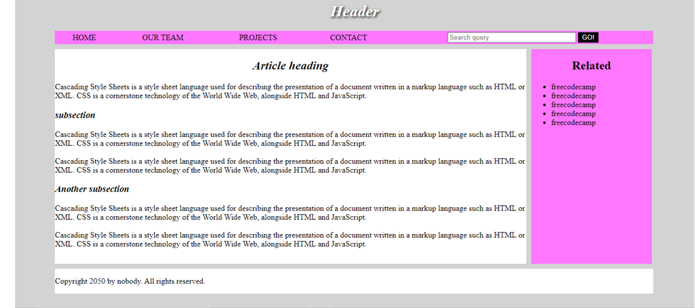

# Assignment of HTML and CSS

> 2022 – Third project from my Nibodh internship

A **basic static website** built using **HTML and CSS** to practice and demonstrate fundamental webpage structure and styling concepts.

---

## 📘 Overview

This project focuses on combining HTML for structure and CSS for presentation to build a simple, well-styled webpage layout.

---

## 🧰 Tech Stack

- **HTML5**
- **CSS3**

---

## 🚀 How to Run

1. Clone the repository  
```bash
   git clone https://github.com/vednav9/nibodh-internship-assignment-of-html-and-css.git
```
2. Open ```index.html``` in your web browser.

## Preview


